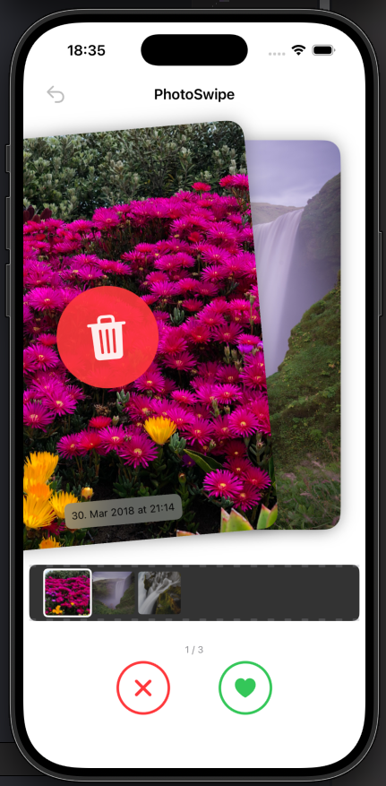
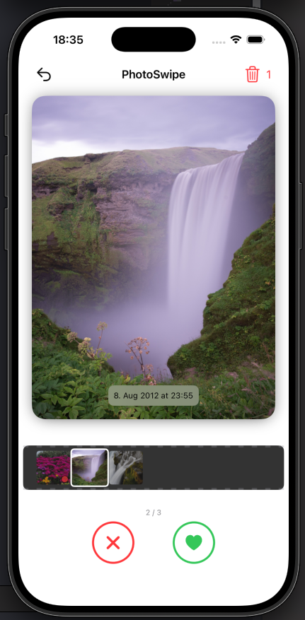

# PhotoSwipe

A simple iOS app to quickly organize your photo library by swiping. Swipe right to keep, swipe left to delete — like a Tinder for your photos.

## Screenshots

<p align="center">
  
  
</p>

## Features

- Swipe-based photo review (right to keep, left to delete)
- Film strip navigation to jump between photos
- Batch delete confirmation with restore option
- Undo support for accidental swipes
- Smooth card stack animations

## Requirements

- iOS 17.0+
- Xcode 26+
- Swift 5.0+

## Getting Started

1. Clone the repository
```bash
git clone https://github.com/mircoporetti/photo-swipe.git
```
2. Open `PhotoSwipe.xcodeproj` in Xcode
3. Build and run on a simulator or device

The app requires photo library access to function. You'll be prompted to grant permission on first launch.

## Architecture

The project follows MVVM with a clean separation of concerns:

```
PhotoSwipe/
├── Models/          # Data models (PhotoModel, SwipeAction)
├── Views/           # SwiftUI views
├── ViewModels/      # View models (ContentViewModel, CardStackViewModel)
├── Services/        # Photo access, caching, delete queue
└── Core/            # App constants
```

## License

All rights reserved. No license is granted at this time.
